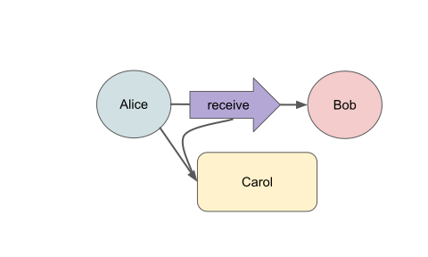
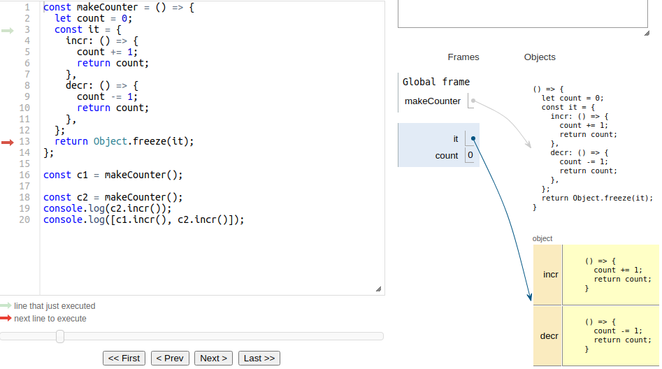

# Hardened JavaScript

::: tip Status: Work In Progress (@@TODO)
:::

::: tip Watch: Object-capability Programming in Secure Javascript

An August 2019 talk by Mark Miller provides a video presentation
of much of the same material. _The relevant part is about 15 minutes long.
The last 10 minutes are Q&A._

<iframe width="560" height="315" src="https://www.youtube.com/embed/YcWXqHPui_w" title="YouTube video player" frameborder="0" allow="accelerometer; autoplay; clipboard-write; encrypted-media; gyroscope; picture-in-picture" allowfullscreen></iframe>
:::


## Counter Example

In case you thought JavaScript cannot be used to write
reliable, secure smart contracts, we begin with this
counter example. :)

<<< @/snippets/test-hardened-js.js#makeCounter

We'll unpack this a bit [below](#objects-and-the-maker-pattern), but for now,
note the use of functions and records:

 - `makeCounter` is a function
 - Each call to `makeCounter` creates a new "instance":
   - a new record with two properties, `incr` and `decr`, and
   - a new `count` variable.
 - The `incr` and `decr` properties are visible from
   outside the object.
 - The the `count` variable is encapsulated; only the
   `incr` and `decr` methods can access it.
 - Each of these instances is isolated from each other

## Counter: Separation of Duties

Suppose we want to keep track of the number of people
inside a room by having an `entryGuard` count up when
people enter the room and an `exitGuard` count down
when people exit the room.

<<< @/snippets/test-hardened-js.js#entryExit

We can give the `entryGuard` access to the `incr` function
and give the `exitGuard` access to the `decr` function.

The result is that the `entryGuard` can _only_ count up
and the `exitGuard` can _only_ count down.

::: tip Eventual send syntax
The `obj ! method(arg)` code in the video means
the same thing as `E(obj).method(arg)`. We'll
cover eventual send when we cover the _distributed object model_. (_TODO: IOU link_)
:::

## Object-capabilities (ocaps)

The separation of duties illustrates the core idea
of _object capabilities_: an object reference familiar
from object programming _is_ a permission.

Alice says: `bob.receive(carol)`


If object `bob` has no reference to object `carol`,
then `bob` cannot invoke `carol`; it cannot
provoke whatever behavior `carol` would have.

If `alice` has a reference `bob` and invokes `bob`,
passing `carol` as an argument, then `alice` has both
used her permission to invoke `bob` and given `bob`
permission to invoke `carol`.

We refer to these object references as _object-capabilities_ or _ocaps_.

## The Principle of Least Authority (POLA)

OCaps give us a natural way to express the
[principle of least authority](https://en.wikipedia.org/wiki/Principle_of_least_privilege), where each object
is only given the permission it needs to do its legitimate job,
such as only giving the `entryGuard` the ability to increment the counter.

This limits the damage that can happen if there is an exploitable bug.

::: tip Watch: Navigating the Attack Surface
to achieve a *multiplicative* reduction in risk<br />
[](https://www.youtube.com/watch?v=wW9-KuezPp8)<br />
_15 min_
:::

## Tool Support: eslint config

::: tip eslint configuration for Jessie
The examples that follow are written using _Jessie_, our
recommended style for writing JavaScript smart contracts.
This `eslint` configuration provides tool support.
:::

1. If not already configured, run `yarn add eslint @jessie.js/eslint-plugin`
2. If not already configured, add the following to your `package.json`:

```json
  "eslintConfig": {
    "extends": [
      "@jessie.js"
    ]
  }
```

3. Put `// @jessie-check` at the beginning of your `.js` source file.
4. Run `yarn eslint --fix path/to/your-source.js`
5. Follow the linter's advice to edit your file, then go back to step 4.

The example in the video cuts a few corners to better
fit on a slide. For clarity and consistency
with [Airbnb JavaScript Style](https://github.com/airbnb/javascript#variables--unary-increment-decrement), we recommend:
 - Avoid `--` and `++` operators.
 - Break lines after `{` and before `}`.

## Objects and the _maker_ pattern

Let's unpack the `makeCounter` example a bit.

JavaScript is somewhat novel in that objects need not belong to any
class; they can just stand on their own:

<<< @/snippets/test-hardened-js.js#singleton

We can make a new such object each time a function is called
using the _maker pattern_:

<<< @/snippets/test-hardened-js.js#maker

::: tip Use lexically scoped variables rather than properties of this.
The style above avoids boilerplate such as `this.x = x; this.y = y`.
:::

::: tip Use arrow functions
We recommend [arrow function](https://developer.mozilla.org/en-US/docs/Web/JavaScript/Reference/Functions/Arrow_functions)
syntax rather than `function makePoint(x, y) { ... }` declarations
for conciseness and to avoid `this`.
:::

## Defensive objects with `harden()`

By default, anyone can clobber the properties of
our objects so that they fail to conform to the expected API:

<<< @/snippets/test-hardened-js.js#clobber

Worse yet is to clobber a property so that it misbehaves but
covers its tracks so that we don't notice:

<<< @/snippets/test-hardened-js.js#exploit

To prevent tampering, use [harden](https://github.com/endojs/endo/blob/master/packages/ses/README.md#harden), which is a deep form of [Object.freeze](https://developer.mozilla.org/en-US/docs/Web/JavaScript/Reference/Global_Objects/Object/freeze).

<<< @/snippets/test-hardened-js.js#defensiveMaker

Any attempt to modify the properties of a hardened object throws:

<<< @/snippets/test-hardened-js.js#thwarted

`harden()` should be called on all objects that will be transferred
across a trust boundary. It's important to `harden()` an object before exposing the object by returning it or passing it to some other function.

::: tip harden(), classes, and details
Note that hardening a class instance also hardens the class.
For more details, see [harden API in the `ses` package](https://github.com/endojs/endo/blob/master/packages/ses/README.md#harden)
:::
## Objects with state

Now let's review the `makeCounter` example:

<<< @/snippets/test-hardened-js.js#counterAnimation

Each call to `makeCounter` creates a new encapsulated `count` variable
along with `incr` and `decr` functions. The `incr` and `decr` functions [close over](https://developer.mozilla.org/en-US/docs/Web/JavaScript/Closures) the `count` variable.

To see how this works in detail, you may want to step through this
[visualization of the code](https://pythontutor.com/live.html#code=const%20makeCounter%20%3D%20%28%29%20%3D%3E%20%7B%0A%20%20let%20count%20%3D%200%3B%0A%20%20const%20it%20%3D%20%7B%0A%20%20%20%20incr%3A%20%28%29%20%3D%3E%20%7B%0A%20%20%20%20%20%20count%20%2B%3D%201%3B%0A%20%20%20%20%20%20return%20count%3B%0A%20%20%20%20%7D,%0A%20%20%20%20decr%3A%20%28%29%20%3D%3E%20%7B%0A%20%20%20%20%20%20count%20-%3D%201%3B%0A%20%20%20%20%20%20return%20count%3B%0A%20%20%20%20%7D,%0A%20%20%7D%3B%0A%20%20return%20Object.freeze%28it%29%3B%0A%7D%3B%0A%0Aconst%20c1%20%3D%20makeCounter%28%29%3B%0A%0Aconst%20c2%20%3D%20makeCounter%28%29%3B%0Aconsole.log%28c2.incr%28%29%29%3B%0Aconsole.log%28%5Bc1.incr%28%29,%20c2.incr%28%29%5D%29%3B&cumulative=false&curInstr=25&heapPrimitives=nevernest&mode=display&origin=opt-live.js&py=js&rawInputLstJSON=%5B%5D&textReferences=false"):

[](https://pythontutor.com/live.html#code=const%20makeCounter%20%3D%20%28%29%20%3D%3E%20%7B%0A%20%20let%20count%20%3D%200%3B%0A%20%20const%20it%20%3D%20%7B%0A%20%20%20%20incr%3A%20%28%29%20%3D%3E%20%7B%0A%20%20%20%20%20%20count%20%2B%3D%201%3B%0A%20%20%20%20%20%20return%20count%3B%0A%20%20%20%20%7D,%0A%20%20%20%20decr%3A%20%28%29%20%3D%3E%20%7B%0A%20%20%20%20%20%20count%20-%3D%201%3B%0A%20%20%20%20%20%20return%20count%3B%0A%20%20%20%20%7D,%0A%20%20%7D%3B%0A%20%20return%20Object.freeze%28it%29%3B%0A%7D%3B%0A%0Aconst%20c1%20%3D%20makeCounter%28%29%3B%0A%0Aconst%20c2%20%3D%20makeCounter%28%29%3B%0Aconsole.log%28c2.incr%28%29%29%3B%0Aconsole.log%28%5Bc1.incr%28%29,%20c2.incr%28%29%5D%29%3B&cumulative=false&curInstr=25&heapPrimitives=nevernest&mode=display&origin=opt-live.js&py=js&rawInputLstJSON=%5B%5D&textReferences=false")

## Hardening JavaScript: strict mode

The first step to hardening JavaScript is that Hardened JavaScript
is always in [strict mode](https://developer.mozilla.org/en-US/docs/Web/JavaScript/Reference/Strict_mode).

[](https://github.com/endojs/Jessie#subsetting-ecmascript)

The most likely way that you would notice this is if you
make a typo in a variable name: this will throw a `ReferenceError`
rather than silently continuing, with untold results.

Important benefits of strict mode include complete encapsulation
(no `caller` etc.) and reliable static scoping.

::: tip TODO: mention `msg.sender`?
:::

## Hardening JavaScript: frozen built-ins

One form of authority that is too widely available in
ordinary JavaScript is the ability to redefine built-ins
(shown above as "mutable primordials").
Consider this `changePassword` function:

<<< @/snippets/test-no-ses.js#changePassword

In ordinary JavaScript, since someone might have redefined
the `includes` method on `Array` objects, we run the risk of password exfiltration:

<<< @/snippets/test-no-ses.js#exfiltrate

In Hardened JavaScript, the `Object.assign` fails because `Array.prototype` and all other
[standard, built-in objects](https://developer.mozilla.org/en-US/docs/Web/JavaScript/Reference/Global_Objects)
are immutable.

::: tip Compatibility issues with `ses` / Hardened JavaScript
Certain libraries that make tweaks to the standard built-ins
may fail in Hardened JavaScript.

The [SES wiki](https://github.com/endojs/endo/wiki) tracks compatibility
reports for NPM packages, including potential workarounds.
:::
## Hardening JavaScript: Limiting Globals with Compartments

A globally available function such as `fetch` means that every object,
including a simple string manipulation function, can access the network.
In order to eliminate this sort of excess authority, _Object-capabity discipline_
calls for limiting globals to immutable data and deterministic functions
(eliminating "ambient authority" in the diagram above).

Hardened JavaScript includes a `Compartment` API for enforcing OCap discipline.
Only the [standard, built-in objects](https://developer.mozilla.org/en-US/docs/Web/JavaScript/Reference/Global_Objects)
such as `Object`, `Array`, and `Promise` are globally available by default
(with an option for carefully controlled exceptions such as `console.log`).
With the default `Compartment` options, the non-deterministic `Math.random`
is not available and `Date.now()` always returns `NaN`.

Almost all existing JS code was written to run under Node.js or inside a browser,
so it's easy to conflate the environment features with JavaScript itself. For
example, you may be surprised that `Buffer` and `require` are Node.js
additions and not part of JavaScript.

The conventional globals defined by browser or node.js hosts are
not available by default in a `Compartment`, whether authority-bearing
or not:

 - authority-bearing:
   - `window`, `document`, `process`, `console`
   - `setImmediate`, `clearImmediate`, `setTimeout`
     - but `Promise` is available, so sometimes
       `Promise.resolve().then(_ => fn())` suffices
     - see also `TimerService` @@TODO IOU link
   - `require` (Use `import` module syntax instead.)
   - `localStorage` (see @@store API, @@orthogonal persistence TODO)
   - `global` (Use `globalThis` instead.)
 - authority-free but host-defined:
   - `Buffer`
   - `URL` and `URLSearchParams`
   - `TextEncoder`, `TextDecoder`
   - `WebAssembly`

Compartments used to load Agoric smart contracts do provide
`console` and `assert` globals. In these compartments, `globalThis` is hardened.

::: tip TODO: ref SES console / assert API?
@@@TODO: migrate from js overview:
Note that `console.log`’s exact behavior is up to
  the host program; display to the operator is not guaranteed. Use the console
  for debug information only. The console is not obliged to write to the POSIX
  standard output.
:::

@@TODO integrate
`debugger` is a first-class JavaScript statement, and behaves as expected in vat code.

### Frozen `globalThis` @@TODO integrate

Vats run in a `Compartment` with a frozen `globalThis` object. If mutable,
it would provide an ambient communication channel. One side of this channel
could set `globalThis.heyBuddyAreYouOutThere = 'exfiltrated message'`, and
the other side could periodically read it. This would violate object-capability
security; objects may only communicate through references.

Vats can create a new `Compartment` object, and decide if it supports object-capability
security. If it does, they should run `harden(compartment.globalThis)` on it
and only then load any untrusted code into it.

## @@@@@@@@@@@ TODO: re-think remaining sections

## Types: advisory

```js
// @ts-check

/** @param {number} init */
const makeCounter = init => {
  let value = init;
  return {
    increment: () => {
      value += 1;
      return value;
    },
    /** @param {number} delta */
    makeOffsetCounter: delta => makeCounter(value + delta),
  };
};
```

 - [TypeScript: Documentation \- Type Checking JavaScript Files](https://www.typescriptlang.org/docs/handbook/type-checking-javascript-files.html)


## Types: advisory (cont.)

If we're not careful, our clients can cause us to mis-behave:

```
> const evil = makeCounter('poison')
> evil2.increment()
'poison1'
```

or worse:

```
> const evil2 = makeCounter({ valueOf: () => { console.log('launch the missiles!'); return 1; } });
> evil2.increment()
launch the missiles!
2
```

## Types: defensive

```js
/** @param {number | bignum} init */
const makeCounter = init => {
  let value = Nat(init);
  return harden({
    increment: () => {
      value += 1n;
      return value;
    },
    /** @param {number | bignum} delta */
    makeOffsetCounter: delta => makeCounter(value + Nat(delta)),
  });
};
```

```
> makeCounter('poison')
Uncaught TypeError: poison is a string but must be a bigint or a number
```

 - **defensive correctness**: a program is _defensively correct_ if it remains correct despite arbitrary behavior on the part of its clients.
   - [Miller, Tribble, Shapiro 2005](http://erights.org/talks/promises/paper/tgc05.pdf)

## Details: Stay Tuned

 - Ordinary programming in JavaScript follows in a later section
 - Much overlap with Java, Python, C, etc.

_If you are **not** familiar with programming in some language, study details a bit and then come back here._

## Electronic Rights: Mint and Purse

**Watch**: [the mint pattern](https://youtu.be/iyuo0ymTt4g?t=1525),
an 8 minute segment starting at 25:00 in

 - [Agoric \+ Protocol Labs // Higher\-order Smart Contracts across Chains \- Mark Miller \- YouTube](https://www.youtube.com/watch?v=iyuo0ymTt4g).

[
](https://youtu.be/iyuo0ymTt4g?t=1525)


```js
const makeMint = () => {
  const ledger = makeWeakMap();

  const issuer = harden({
    makeEmptyPurse: () => mint.makePurse(0),
  });

  const mint = harden({
    makePurse: initialBalance => {
      const purse = harden({
        getIssuer: () => issuer,
        getBalance: () => ledger.get(purse),

        deposit: (amount, src) => {
          Nat(ledger.get(purse) + Nat(amount));
          ledger.set(src, Nat(ledger.get(src) - amount));
          ledger.set(purse, ledger.get(purse) + amount);
        },
        withdraw: amount => {
          const newPurse = issuer.makeEmptyPurse();
          newPurse.deposit(amount, purse);
          return newPurse;
        },
      });
      ledger.set(purse, initialBalance);
      return purse;
    },
  });

  return mint;
};
```

## Agoric JavaScript APIs

 - [ERTP Introduction](https://agoric.com/documentation/getting-started/ertp-introduction.html#creating-assets-with-ertp)
 - [Introduction to Zoe](https://agoric.com/documentation/getting-started/intro-zoe.html#what-is-zoe)
 - [Remote object communication with E\(\)](https://agoric.com/documentation/guides/js-programming/eventual-send.html)

## Appendix / Colophon: Fodder / Brainstorm

 - structure from [E in a Walnut](http://www.skyhunter.com/marcs/ewalnut.html#SEC8)
   - as adapted in [Practical Security: The Mafia game — Monte 0\.1 documentation](https://monte.readthedocs.io/en/latest/ordinary-programming.html)
 - JSON / Justin / Jessie as in [Jessica](https://github.com/agoric-labs/jessica)
 - Build slides with [Remark](https://remarkjs.com/#1)
   - example: [kumc\-bmi/naaccr\-tumor\-data](https://github.com/kumc-bmi/naaccr-tumor-data)
