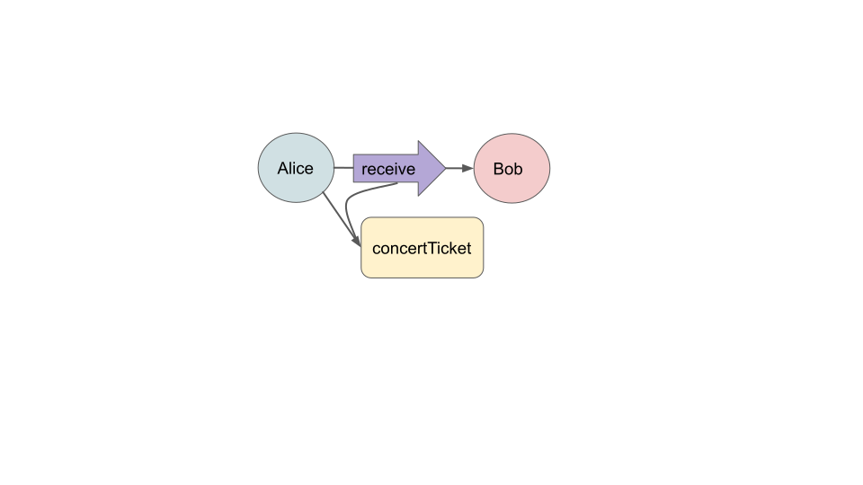

# Intro to Hardened JavaScript

::: tip Status: Work In Progress
:::

JavaScript is a remarkably expressive programming language, but
not all of the expressiveness is useful for building smart contracts.

Consider this `changePassword` function:

<<< @/snippets/test-no-ses.js#changePassword

In ordinary JavaScript, since someone might have redefined
the `includes` method on `Array` objects, we run the risk of password exfiltration:

<<< @/snippets/test-no-ses.js#exfiltrate

## Object-Capability (OCap) Security and the Principle of Least Authority

In Hardened JavaScript, the `Object.assign` fails because `Array.prototype` and all other
[standard, built-in objects](https://developer.mozilla.org/en-US/docs/Web/JavaScript/Reference/Global_Objects)
are immutable. In fact, the first property of an _object-capability_ system is that
**everything global is pure functions or data** with no shared mutable state and no IO access.
Network IO via the `fetch` object is not available in the global
scope (nor by way of imported Hardened JavaScript modules);
likewise, random number IO with `Math.random` is not available
and `Date.now()` always returns `NaN`, preventing clock IO.

::: tip TODO: how to advise against / prohibit exporting mutable state from modules?
:::

Hardened JavaScript is always in
[strict mode](https://developer.mozilla.org/en-US/docs/Web/JavaScript/Reference/Strict_mode),
which provides complete encapsulation so that we have the
next property of an object-capability system:
**access to (and modification of) internal state of an objects is voluntary**,
as expressed in its external methods.
Objects can prevent other objects from directly reading or tampering with their contents.

::: tip TODO: mention `caller`, `msg.sender`?
:::

JavaScript, including Hardened JavaScript, is memory-safe,
providing the final property of an object-capability system: **object references cannot be forged**.
If object `bob` has no reference to object `concertTicket`,
the only way `bob` can obtain a reference to it
is if some object `alice` has references to both `bob` and `concertTicket`
and passes `concertTicket` to `bob` in a call such as `bob.receive(concertTicket)`.
We refer to these unforgeable object references as _object-capabilities_ or _OCaps_.



With the properties of an OCap system in place, we need no
separate access control mechanism. The fact that `alice` is authorized
to grant `bob` access to the `concertTicket` is represented by the fact that `alice` has
references to both `bob` and the `concertTicket`. The `bob.receive` method
needs no check on the identity, groups, or roles of its caller.

As we will see, OCaps let us express many such powerful patterns of cooperation without vulnerability,
leading to convenient application of the [principle of least authority](https://en.wikipedia.org/wiki/Principle_of_least_privilege).

::: tip Unforgeable references at compile time and runtime
In C/C++, if object `bob` learns that object `concertTicket` of type `Ticket` is
at address `size_t addr = 0xDEADBEAF;` in memory, `bob` can
_forge_ a reference to `concertTicket` by casting the number to a pointer: `Ticket *concertTicket = (Ticket*)addr;`.
In rust and go, forging references is allowed only in explicitly unsafe constructs,
but this is a compile-time check. In JavaScript, memory-safety is a runtime property.
:::

## Lint Tools for Hardened JavaScript and Jessie

::: tip eslint configuration for Jessie
The examples that follow are written using Jessie, our
recommended style for writing JavaScript smart contracts
This `eslint` configuration provides tool support.
:::

1. If not already configured, run `yarn add eslint @jessie.js/eslint-plugin`
2. If not already configured, add the following to your `package.json`:

```json
  "eslintConfig": {
    "extends": [
      "@jessie.js"
    ]
  }
```

3. Put `// @jessie-check` at the beginning of your `.js` source file.
4. Run `yarn eslint --fix path/to/your-source.js`
5. Follow the linter's advice to edit your file, then go back to step 4.

## Stateless Objects and Makers

JavaScript is somewhat novel in that objects need not belong to any
class; they can just stand on their own:

<<< @/snippets/test-hardened-js.js#singleton

We can make a new such object each time a function is called
using the _maker pattern_:

<<< @/snippets/test-hardened-js.js#maker

::: tip Use lexically scoped variables rather than properties of this.
The style above boilerplate such as `this.x = x; this.y = y`.
:::

::: tip Use arrow functions
We recommend [arrow function](https://developer.mozilla.org/en-US/docs/Web/JavaScript/Reference/Functions/Arrow_functions)
syntax rather than `function makePoint(x, y) { ... }` declarations
for conciseness and to avoid some hazards involving `this`.
:::

## WARNING: Pervasive Mutability

While JavaScript allows complete encapsulation, it is unfortunately
not the default. By default, anyone can clobber the properties of
our objects so that they fail to conform to the expected API:

<<< @/snippets/test-hardened-js.js#clobber

Worse yet is to clobber a property so that it misbehaves but
covers its tracks so that we don't notice:

<<< @/snippets/test-hardened-js.js#exploit

## Defensive objects with `harden()`

To prevent tampering, use `harden()` before returning an object
(or otherwise exposing it by, for example, passing it to a function):

<<< @/snippets/test-hardened-js.js#defensiveMaker

Any attempt to modify the properties of a hardened object throws:

<<< @/snippets/test-hardened-js.js#thwarted

## Stateful objects and Facets

```js
const makeCounter = init => {
  let value = init;
  return harden({
    increment: () => {
      value += 1;
      return value;
    },
    makeOffsetCounter: delta => makeCounter(value + delta),
  });
};
```

```
> const c3 = Object.freeze(c1.makeOffsetCounter(10));
undefined
> c3.increment = () => { console.log('launch the missiles!'); }
TypeError: Cannot assign to read only property 'increment' of object '#<Object>'
> c3.increment()
15
```

 - _caveat_: exception is thrown in strict mode. REPL might not throw.
 - regardless, the object defended itself
 - Jessie pre-defines `harden` (_as does Agoric smart contract framework_)
   - see the `ses` [hardened Javascript package](https://github.com/endojs/endo/tree/master/packages/ses#harden) otherwise

## Object makers

```js
const makeCounter = init => {
  let value = init;
  return {
    increment: () => {
      value += 1;
      return value;
    },
    makeOffsetCounter: delta => makeCounter(value + delta),
  };
};
```

```console
$ node
Welcome to Node.js v14.16.0.
Type ".help" for more information
> const c1 = makeCounter(1);
> c1.increment();
2
> const c2 = c1.makeOffsetCounter(10);
> c1.increment();
3
> c2.increment();
13
> [c1.increment(), c2.increment()];
[ 4, 14 ]
```

 - An object is a record of functions that close over shared state.
 - The `this` keyword is not part of Jessie, so neither are constructors.
 - A `makeCounter` function takes the place of the `class Counter` constructor syntax.


_TODO: `decrement()`, facets_


## Types: advisory

```js
// @ts-check

/** @param {number} init */
const makeCounter = init => {
  let value = init;
  return {
    increment: () => {
      value += 1;
      return value;
    },
    /** @param {number} delta */
    makeOffsetCounter: delta => makeCounter(value + delta),
  };
};
```

 - [TypeScript: Documentation \- Type Checking JavaScript Files](https://www.typescriptlang.org/docs/handbook/type-checking-javascript-files.html)


## Types: advisory (cont.)

If we're not careful, our clients can cause us to mis-behave:

```
> const evil = makeCounter('poison')
> evil2.increment()
'poison1'
```

or worse:

```
> const evil2 = makeCounter({ valueOf: () => { console.log('launch the missiles!'); return 1; } });
> evil2.increment()
launch the missiles!
2
```

## Types: defensive

```js
/** @param {number | bignum} init */
const makeCounter = init => {
  let value = Nat(init);
  return harden({
    increment: () => {
      value += 1n;
      return value;
    },
    /** @param {number | bignum} delta */
    makeOffsetCounter: delta => makeCounter(value + Nat(delta)),
  });
};
```

```
> makeCounter('poison')
Uncaught TypeError: poison is a string but must be a bigint or a number
```

 - **defensive correctness**: a program is _defensively correct_ if it remains correct despite arbitrary behavior on the part of its clients.
   - [Miller, Tribble, Shapiro 2005](http://erights.org/talks/promises/paper/tgc05.pdf)

## Details: Stay Tuned

 - Ordinary programming in JavaScript follows in a later section
 - Much overlap with Java, Python, C, etc.

_If you are **not** familiar with programming in some language, study details a bit and then come back here._

## Electronic Rights: Mint and Purse

**Watch**: [the mint pattern](https://youtu.be/iyuo0ymTt4g?t=1525),
an 8 minute segment starting at 25:00 in

 - [Agoric \+ Protocol Labs // Higher\-order Smart Contracts across Chains \- Mark Miller \- YouTube](https://www.youtube.com/watch?v=iyuo0ymTt4g).

[
](https://youtu.be/iyuo0ymTt4g?t=1525)


```js
const makeMint = () => {
  const ledger = makeWeakMap();

  const issuer = harden({
    makeEmptyPurse: () => mint.makePurse(0),
  });

  const mint = harden({
    makePurse: initialBalance => {
      const purse = harden({
        getIssuer: () => issuer,
        getBalance: () => ledger.get(purse),

        deposit: (amount, src) => {
          Nat(ledger.get(purse) + Nat(amount));
          ledger.set(src, Nat(ledger.get(src) - amount));
          ledger.set(purse, ledger.get(purse) + amount);
        },
        withdraw: amount => {
          const newPurse = issuer.makeEmptyPurse();
          newPurse.deposit(amount, purse);
          return newPurse;
        },
      });
      ledger.set(purse, initialBalance);
      return purse;
    },
  });

  return mint;
};
```

## Agoric JavaScript APIs

 - [ERTP Introduction](https://agoric.com/documentation/getting-started/ertp-introduction.html#creating-assets-with-ertp)
 - [Introduction to Zoe](https://agoric.com/documentation/getting-started/intro-zoe.html#what-is-zoe)
 - [Remote object communication with E\(\)](https://agoric.com/documentation/guides/js-programming/eventual-send.html)

## Appendix / Colophon: Fodder / Brainstorm

 - structure from [E in a Walnut](http://www.skyhunter.com/marcs/ewalnut.html#SEC8)
   - as adapted in [Practical Security: The Mafia game — Monte 0\.1 documentation](https://monte.readthedocs.io/en/latest/ordinary-programming.html)
 - JSON / Justin / Jessie as in [Jessica](https://github.com/agoric-labs/jessica)
 - Build slides with [Remark](https://remarkjs.com/#1)
   - example: [kumc\-bmi/naaccr\-tumor\-data](https://github.com/kumc-bmi/naaccr-tumor-data)

[](https://github.com/endojs/Jessie#subsetting-ecmascript)
